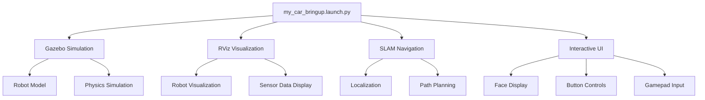

# ROS2 Autonomous Car Project 🚗🤖

A fully-featured ROS2 autonomous car simulation project, including **Gazebo simulation**, **SLAM navigation**, and an **interactive user interface**. Designed for learning, experimentation, and autonomous robot research.

---

## 🚀 Project Overview

This project provides a complete autonomous car system with:

- **Gazebo Simulation** – Realistic 3D environment for testing robot behaviors  
- **SLAM Navigation** – Simultaneous Localization and Mapping using Nav2  
- **Interactive UI** – Custom touchscreen interface with facial expressions, button controls, and joystick support  
- **Robot Description** – Full URDF/XACRO robot model with sensors and controllers  

---

## 📁 Project Structure

```
car/
├─ my_car_bringup/           # Launch package for the complete system
├─ my_car_description/       # Robot description and configuration
│  ├─ launch/               # Component launch files
│  ├─ urdf/                 # Robot URDF/XACRO files
│  ├─ config/               # Controller and Nav2 parameters
│  ├─ maps/                 # Pre-built maps
│  ├─ rviz/                 # RViz configuration files
│  └─ worlds/               # Gazebo world files
└─ articubot_one_ui/         # Interactive UI package
└─ articubot_one_ui/      # UI node implementation
```

> **Credits**: The `articubot_one_ui` folder is based on the work of [@joshnewans](https://github.com/joshnewans/articubot_one_ui/). Thank you for this excellent UI framework!

---

## 🎮 User Interface Features

The `articubot_one_ui` interface includes:

- **Facial Expression Display** – Shows robot "emotions" based on movement  
- **Button Control Page** – Grid interface with customizable actions  
- **Motor Control** – Start/stop LiDAR and other actuators  
- **Real-Time Updates** – Responds to joystick input and velocity commands (`cmd_vel`)

---

## 🛠️ Prerequisites

- ROS2 Humble or later  
- Gazebo classic (11 recommended)  
- Navigation2 stack  
- SLAM Toolbox  
- Python3 (with `tkinter`)  
- Xbox controller (optional, for UI interaction)

### Install Dependencies

```bash
# ROS2 and navigation packages
sudo apt update
sudo apt install ros-humble-gazebo-ros-pkgs ros-humble-navigation2 \
ros-humble-nav2-bringup ros-humble-slam-toolbox \
ros-humble-robot-state-publisher ros-humble-joint-state-publisher

# Python dependencies
sudo apt install python3-tk
```

---

## 🏗️ Building the Workspace

```bash
# Navigate to ROS2 workspace
cd ~/ros2_ws/src

# Clone repository
git clone https://github.com/umangjain-07/Car-ROS2/ car

# Build the workspace
cd ~/ros2_ws
colcon build --packages-select my_car_bringup my_car_description articubot_one_ui

# Source workspace
source install/setup.bash
```

### Verify Installation

```bash
ros2 pkg list | grep my_car
ros2 pkg list | grep articubot
```

---

## 🎯 Launching the Project

### Full System Launch

```bash
ros2 launch my_car_bringup my_car_bringup.launch.py
```

This launches:

* Gazebo simulation with the car model
* RViz visualization
* SLAM localization using a pre-built map
* Interactive UI with joystick support

### Individual Component Launches

```bash
# Gazebo simulation only
ros2 launch my_car_description my_car_gazebo.launch.py

# RViz visualization only
ros2 launch my_car_description display.launch.py

# SLAM navigation only
ros2 launch my_car_description my_car_slam.launch.py

# UI only
ros2 launch my_car_description extra_feature.launch.py
```

---

## 🎮 UI Controls

### Gamepad Controls

| Control     | Action                             |
| ----------- | ---------------------------------- |
| Left Stick  | Move robot forward/backward & turn |
| Button 8    | Switch to face display mode        |
| Button 9    | Switch to button control mode      |
| A Button    | Start LiDAR motor                  |
| B Button    | Stop LiDAR motor                   |
| X/Y Buttons | Custom configurable actions        |

### UI Modes

1. **Face Mode** – Animated facial expressions
2. **Button Mode** – Grid of customizable buttons for robot commands

---

## 🗺️ Navigation Features

* Pre-built map (`my_car_map.yaml`) for localization
* SLAM Toolbox integration for mapping and localization
* Navigation2 stack for autonomous path planning
* Custom parameters in `nav2_params.yaml`

---

## 🔧 Configuration

* **Robot Parameters:** `my_car_description/config/my_car_controller.yaml`
* **Navigation Parameters:** `my_car_description/config/nav2_params.yaml`
* **UI Customization:** Modify `articubot_one_ui/articubot_one_ui/ui_node.py`

---

## 🐛 Troubleshooting

| Issue                  | Solution                                                                                    |
| ---------------------- | ------------------------------------------------------------------------------------------- |
| Gazebo not starting    | Ensure installation: `sudo apt install gazebo11 libgazebo11-dev`                            |
| UI not displaying      | Check tkinter: `sudo apt install python3-tk`                                                |
| Navigation not working | Verify Nav2 installation: `sudo apt install ros-humble-navigation2 ros-humble-nav2-bringup` |
| Package not found      | Rebuild and source workspace: `colcon build && source install/setup.bash`                   |

---

## 📊 System Architecture



---

## 🤝 Contributing

1. Fork the repository
2. Create a feature branch
3. Make changes and test
4. Submit a pull request

---

## 📄 License

Apache License 2.0 – see `LICENSE` file for details.

---

## 🙏 Acknowledgments

* **articubot\_one\_ui** – [@joshnewans](https://github.com/joshnewans/articubot_one_ui/)
* **ROS2 Community** – Navigation and simulation packages
* **Gazebo Team** – 3D physics simulation

---

**Happy Autonomous Driving! 🚗💨**
